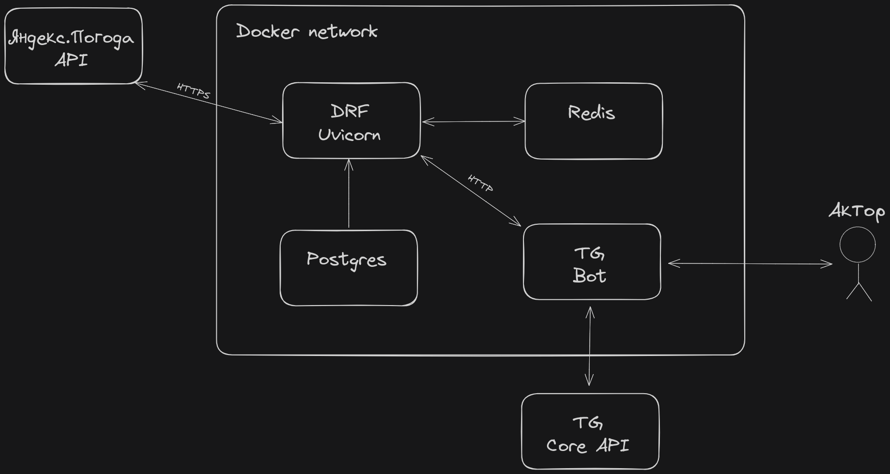

# Тестовое задание TL GROUP
## Прогноз погоды в телеграм-боте

Проект реализован в виде тестового задания для компании TL GROUP.

### Задача 
Реализовать API, используя Django (DRF) и API от Яндекс.Погоды, для получения погоды по координатам и реализовать телеграм-бота.

### Описание
Реализовал API, используя DRF. Ограничения на количество отправляемых от пользователя запросов реализовал с помощью Redis.
Добавил алгоритм Левенштейна для обработки ошибок от пользователя. Добавил Swagger. Активно использовал типизацию.
Для хранения и получения координат использовал список городов, который взял из открытого доступа. Телеграм-бота разработал, используя aiogram.
Проект обернут в docker-compose.

### Разворачивание

1. Скопировать файл `.env.example` в `.env`, заполнить необходимые переменные.
2. Запустить командой:
```bash
docker-compose up -d
```

### Архитектура

